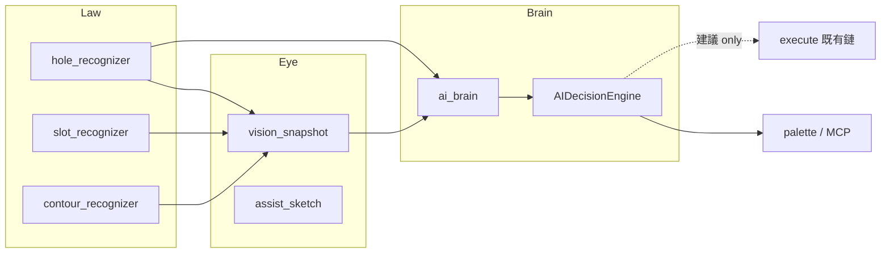
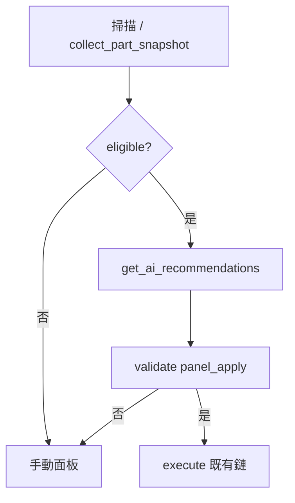

# 半自動加工選單 — AI 系統架構（眼 / 法 / 腦）

> **適用版號**：V2.0347  
> **狀態**：Phase 1–3 完成；**直覺式編程**（短期主線）已實作，見 §7  
> **原則**：**法**（孔鏈 baseline）與 **execute** 契約不變；AI 填入 `tmplIdx`／2D 模板，**不**覆寫 `_isThrough` 與倒角全域篩選。

---

## 1. 三層模型

| 層 | 代號 | 模組 | 職責 | 狀態 |
|----|------|------|------|------|
| 眼 | Eye | `vision/` | 唯讀 `vision_snapshot`、驗證草圖 | **已完成** |
| 法 | Law | `recognizers/` | 孔／槽／輪廓 B-rep 辨識（baseline） | **穩定** |
| 腦 | Brain | `ai_brain`、`ai_decision_engine`、`ai_panel_apply` | 方案、參數建議、**面板套用 patch** | **Phase 2–3** |

---

## 2. 資料契約

### 2.1 輸入（腦層）

| 來源 | 欄位 | 說明 |
|------|------|------|
| 面板掃描 | `holes_data`, `slots_data`, `flat_depths` | 與 UI 表單同源 |
| 視線法 | `runtime_state.vision_snapshot` | `recognized_features` + `profiles.topview_semantic` |
| 刀具庫 | `documentToolLibrary` | Fusion CAM 當前文件刀具 |
| 模板索引 | `allTopFaceRoughMap` 等 | 材質對應 2D 模板名 |

### 2.2 輸出（`get_ai_recommendations`）

| 欄位 | 說明 |
|------|------|
| `decisions.top_face` | 面銑刀具、RPM、F |
| `decisions.outer_contour` | 外輪廓深度、立銑刀建議 |
| `decisions.holes[]` | 每孔工藝鏈（鑽／攻牙） |
| `decisions.slots[]` | 槽寬、推薦刀徑、倒角提示（Phase 2+） |
| `decisions.vision` | 來自 snapshot 的摘要（周長、台面數） |
| `recommended_templates` | 粗精 2D 模板名 |
| `overall_report` | 面板文字區顯示 |
| `panel_apply` | `hole_rows` / `slot_rows` / `pocket_corner_r_rows` / `recommended_templates` |
| `feature_catalog_summary` | 辨識目錄摘要 |

### 2.3 面板 AI 操作（Phase 3）

| 按鈕 | 行為 |
|------|------|
| ① 僅 AI 分析 | 只更新報告區，**不**改下拉 |
| ② 套用 AI 到面板 | 寫入孔／槽／口袋 R／2D 模板；操作者可逐列修改 |
| ③ 套用並執行 | 確認對話框 → 套用 → 既有 `execute`（先2D後3D） |

模組：`recognizers/ai_panel_apply.build_panel_apply_patch`。

---

## 3. 階段路線圖

### Phase 1 — 眼（已完成）

- `build_part_vision_snapshot`
- WCS 俯視草圖、多台階外輪廓、`loop_edges` 槽

### Phase 2 — 腦接入視線（本輪）

- `ai_brain.build_geom_features_for_ai(...)` 合併 snapshot
- `AIDecisionEngine` 擴充槽／輪廓決策
- `get_ai_recommendations` 自動帶入 `vision_snapshot`
- **不修改** `_executeFromPalette` 主路徑

### Phase 3 — 建議 → 面板套用（已完成）

- `panel_apply` 由 `ai_panel_apply` 產生；`palette.html` 三按鈕分流
- **不**自動改倒角全域（C0.2/C0.3/僅倒角）；執行仍走 `_executeFromPalette`
- `run_internal_ai_autopilot`（MCP）仍保留，面板以 **③** + 確認為準

### Phase 4 — 外部 LLM（可選）

- 僅將 **結構化 JSON**（snapshot + ai_plan）送外部模型做自然語言解釋
- **禁止** LLM 直接改 execute 參數或覆寫 baseline

### Phase 5 — 直覺式編程（短期，已完成）

- 模組：`recognizers/intuitive_programming.py`
- 白名單資格 → `get_ai_recommendations` → 驗證 `panel_apply` → 既有 execute
- 詳見 **`docs/INTUITIVE_PROGRAMMING.md`**

---

## 4. MCP / 自動化

| Action | 用途 |
|--------|------|
| `get_ai_recommendations` | 取得完整 AI 方案（分析／手動套用） |
| `check_intuitive_eligibility` | 直覺式白名單資格（不執行） |
| `run_intuitive_one_click` | **一鍵直覺式**（掃描→資格→套版→執行） |
| `run_intuitive_programming` | 直覺式：資格閘門 + 套版 + 可選 execute |
| `check_thinking_eligibility` | 思考式 L0：須通過直覺式基底資格 |
| `run_thinking_programming` | 思考式 L0：加工＝直覺式，標記 `thinking` |
| `get_thinking_layers` | 思考層級說明（L0 實作／L1 L2 規劃） |
| `list_reference_f3z` | 列出 `E:\Fusion\參考範本\f3z已編程` |
| `import_cam_from_active_document` | CAM 模板路徑／顯示名 + 掃描幾何 → KnowledgeDB + 快照 |
| `batch_import_reference_library` | 依 manifest 逐檔 open + 匯入（`max_files`，狀態檔） |
| `run_internal_ai_autopilot` | 舊一鍵（**無**資格閘門）；新件請用直覺式 |
| `scan_machining_features` | 特徵列掃描 + `feature_catalog` / `feature_catalog_summary` |
| init JSON | `featureCatalog` 摘要（`counts_by_category`） |
| `get_addin_info` | 版號、Setup |

---

## 7. 學習層 vs 使用層（直覺式／思考式）

**學習層（持續）**：辨識、特徵目錄、幾何語意、KnowledgeDB、編程概念 —— **不因模式而關閉**。  
**使用層（每次操作）**：決定這次 AI **允許做多大的編程決策**。

| | **直覺式編程** | **思考式編程** |
|---|----------------|----------------|
| **代號** | `programming_mode: intuitive` · `usage_tier: restricted` | `thinking` · `open` |
| **含義** | **有限制的編程** — 僅已定模板 + 白名單 | **開放式編程** — 較大規劃空間（長期） |
| **與學習** | 仍掃描、仍記錄案例；執行受閘門約束 | 共用同一套概念與案例庫；決策更開放 |
| **時程** | **現在**（已實作） | **L0 已實作**（加工＝直覺式）；L1/L2 加深探索 |
| **關係** | 基底／種子 | **以直覺式為啟發**，先 L0 再 L1/L2 |
| **風險** | **低** | **中高** |
| **失敗** | 資格未過 → **不執行** | 驗證後執行 + 教訓回寫 |

完整說明：**`docs/PROGRAMMING_MODES.md`**。直覺式：**`docs/INTUITIVE_PROGRAMMING.md`**。思考式（直覺式基底）：**`docs/THINKING_PROGRAMMING.md`**。

**直覺式**不發明新工序、不覆寫孔 baseline、不代替翻面裝夾。

---

## 8. 直覺式資料流

實作與白名單數值：**`docs/INTUITIVE_PROGRAMMING.md`**。

---

## 5. 驗收（Phase 2）

- [ ] 重新掃描後，`get_ai_recommendations` 回傳 `decisions.vision` 含 contour 列數、外周長
- [ ] 有槽時 `decisions.slots` 非空，刀徑建議符合 `width_mm`
- [ ] `ENABLE_VISION_LAYER=False` 時 AI 仍可用（僅無 vision 區塊）
- [ ] 面板「一鍵 AI 智能加工優化」報告含視線摘要一行

---

## 6. 相關文件

- `docs/PROGRAMMING_MODES.md` — 學習層／使用層、直覺式 vs 思考式
- `docs/INTUITIVE_PROGRAMMING.md` — 直覺式白名單、面板、MCP 驗收
- `docs/VISION_SNAPSHOT_v1.md`
- `docs/VISION_CONTOUR_AND_SKETCH.md`
- `docs/行為準則.md` §11（視線法邊界）
- `docs/RAYVISION_INTEGRATION_PLAN.md`（併入索引）
