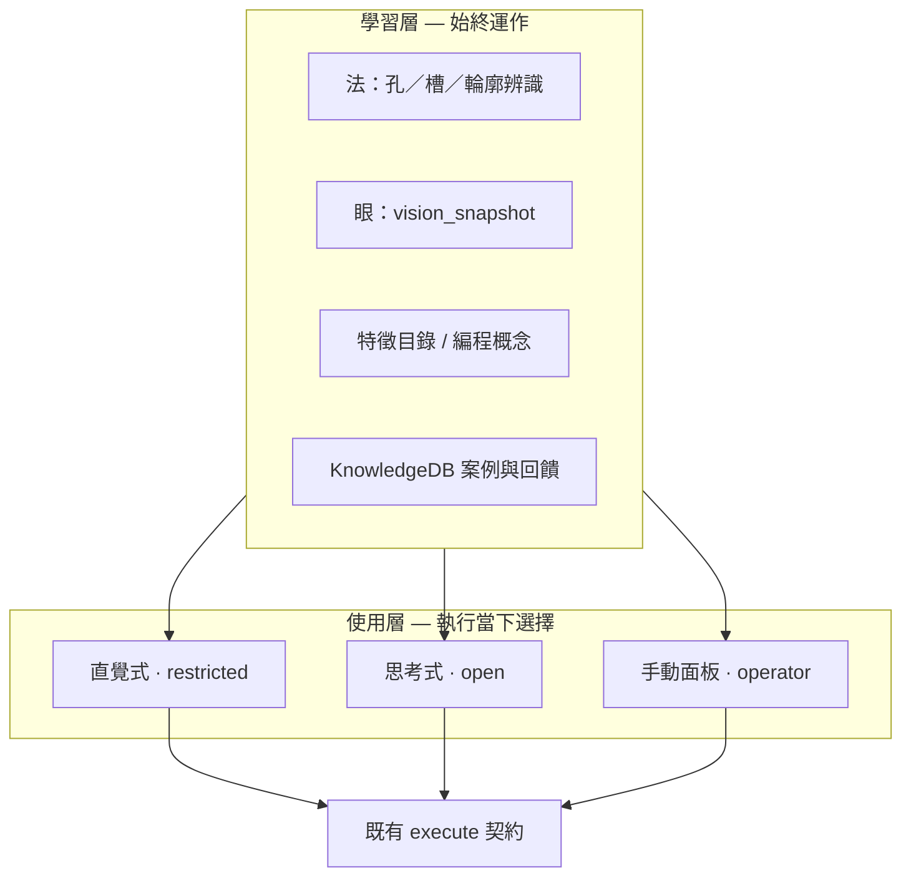

# 編程模式：學習層 vs 使用層

> **核心**：AI **持續學習編程概念**；操作時再選 **直覺式（有限制）** 或 **思考式（開放式）**。

---

## 1. 兩層架構

| 層 | 問的問題 | 是否關閉 |
|----|----------|----------|
| **學習層** | 這是什麼特徵？與 CAM 概念如何對應？歷史上這類几何常用哪個模板？ | **否** — 掃描、分析、執行後記錄都會養概念與案例 |
| **使用層** | 這次允許 AI 做多少決策？要不要白名單擋下？ | **每次操作者選** — 直覺式 / 思考式 / 手動 |

直覺式 **不是**「不學習」，而是「**學了，但這次只在安全範圍內動手**」。

---

## 2. 使用層：兩種 AI 編程方式

| | **直覺式編程** | **思考式編程** |
|---|----------------|----------------|
| 代號 | `programming_mode: intuitive` | `programming_mode: thinking` |
| 使用層 tier | `restricted` | `open` |
| 決策空間 | 封閉：僅已定頂面／外輪廓／孔等模板 + 白名單 | **L0＝與直覺式相同**；L1+ 在基底上加深 |
| 與直覺式關係 | 種子／日常預設 | **以直覺式為啟發**：先站穩 L0，再探索 |
| 執行閘門 | **資格未過不執行** | L0：**須先通過直覺式白名單** |
| 風險定位 | **低** | L0 低；L1+ 逐步提高 |
| 實作狀態 | **已實作** — `INTUITIVE_PROGRAMMING.md` | **L0 已實作** — `THINKING_PROGRAMMING.md` |
| 典型零件 | 簡單雙面圓孔板 | L0 同左；L2 多 Setup（規劃） |

**手動面板**執行標記為 `manual`（`usage_tier: operator`），同樣寫入學習庫，供兩種模式共用。

---

## 3. 學習層做什麼（與模式無關）

| 機制 | 模組 | 說明 |
|------|------|------|
| B-rep 辨識 | `recognizers/*` | 孔 baseline、槽、輪廓、官方特徵 |
| 編程概念目錄 | `machining_feature_catalog` | category → 工序策略對照 |
| 幾何語意 | `ai_brain` | 合併掃描 + vision 供決策 |
| 模板案例庫 | `knowledge_db` + `ai_training` | 執行後記錄模板選擇；`knowledge_feedback` 評分 |
| 建議增強 | `enhance_panel_apply_with_knowledge` | 高信心歷史影響 **建議**，直覺式仍受白名單約束執行 |

執行記錄欄位（V2.0315+）：`programming_mode`、`usage_tier` — 便於統計「直覺式成功案例」與日後思考式分開調參。

---

## 4. MCP / 面板對照

| 操作 | 模式 | 學習層 | 使用層 |
|------|------|--------|--------|
| 掃描 / init | — | ✓ | — |
| ① 僅 AI 分析 | — | ✓ | 不執行 |
| ② 套用 AI | — | ✓ | 手動把關 |
| 檢查直覺式資格 | intuitive | ✓ | 只檢查 |
| 直覺式編程 | intuitive | ✓ | restricted + execute |
| 檢查／思考式編程 L0 | thinking | ✓ | 基底＝直覺式，標記 thinking |
| 手動執行 | manual | ✓（記錄） | operator |

---

## 5. 相關文件

- `docs/INTUITIVE_PROGRAMMING.md` — 直覺式白名單與驗收  
- `docs/THINKING_PROGRAMMING.md` — 思考式層級（L0 直覺式基底 → L1/L2）  
- `docs/AI_SYSTEM_ARCHITECTURE.md` §7～8 — 眼／法／腦與資料流  
- `docs/AI_TRAINING.md` — KnowledgeDB 訓練流程  
